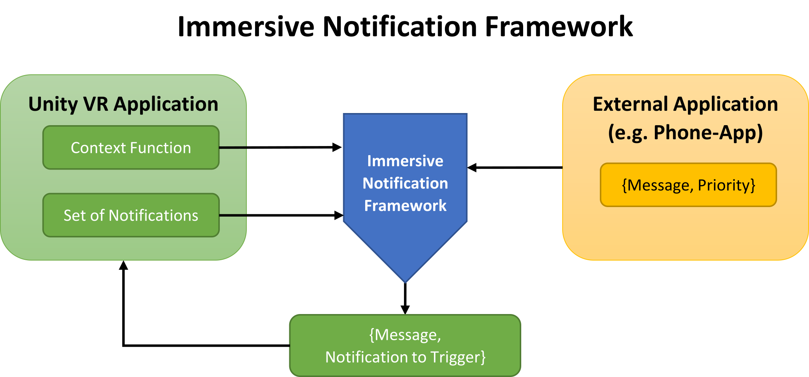
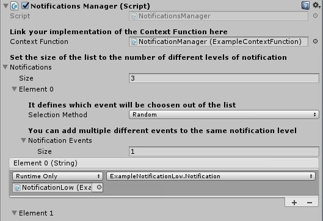
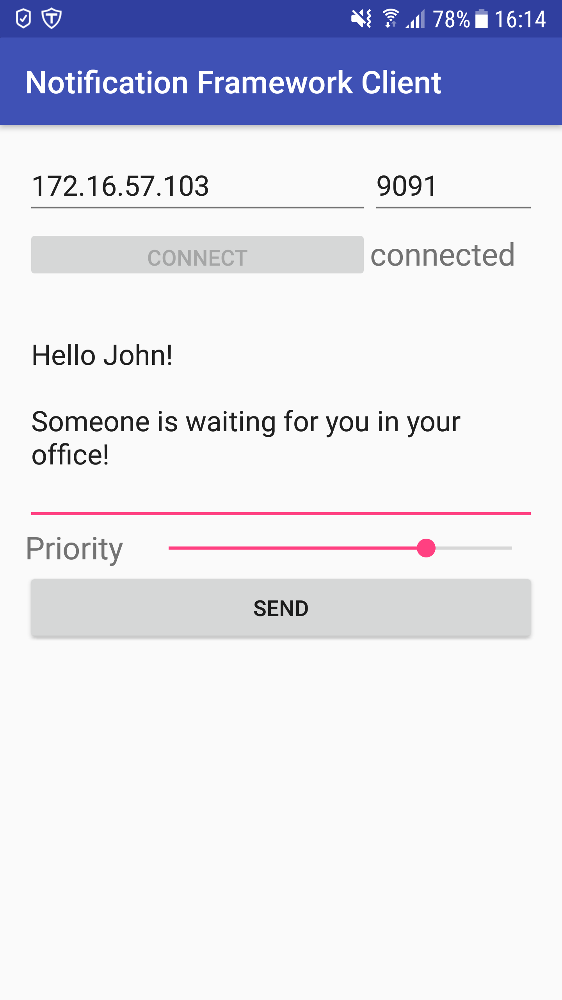

# Immersive Notification Framework

## Overview
Users playing virtual reality (VR) games are immersed in virtual environments (VEs). 
But what if someone outside this VE wants to notify the user or send her a message? 
How can the notification of the VR user be optimized for the VR experience?
A standard approach is to show a default pop-up with the incoming message, independent of the user’s situation in the game or simulation. This is not optimal as it might negatively influence the user’s immersion, distract her from crucial tasks in the VE or might even go unnoticed by the user, depending on her situation in the virtual world.

This framework tries to solve these problems with an adaptive approach to notifying a VR user of incoming messages.

## Framework Usage

1. Import the .unitypackage.
2. Append the NotificationsManager script to a GameObject.
3. Create a class which inherits from ContextFunction and implement the Evaluate function. Drag this class into the NotificationsManager.
4. Define the amount of different notification levels inside your application by setting the value in the NotificationsManager.
5. Create immersive notification animations and functions triggering them with string arguments for incoming messages.
6. Plug the triggering functions into the appropriate slot inside the NotificationsManager. These functions will be called when incoming messages with a suitable priority level were processed by the framework.

For reference and an example, please take a look at the example scene!

## Send Messages via the Test Android App

1. Install the notification-framework-client-v1.0.apk on your Android phone.
3. Set the IP-address of the machine running the Unity program and choose the port which is seleted in the UDPReceive script in Unity.
4. Press connect.
5. Input message and priority.
6. Send the message.

## Credits
Before use, please see the [LICENSE](LICENSE.md) for copyright and license details.

This work was supported by the [Deutsches Forschungszentrum für Künstliche Intelligenz GmbH](https://www.dfki.de/) (DFKI; German Research Center for Artificial Intelligence) and [Saarland University](https://www.uni-saarland.de/).

